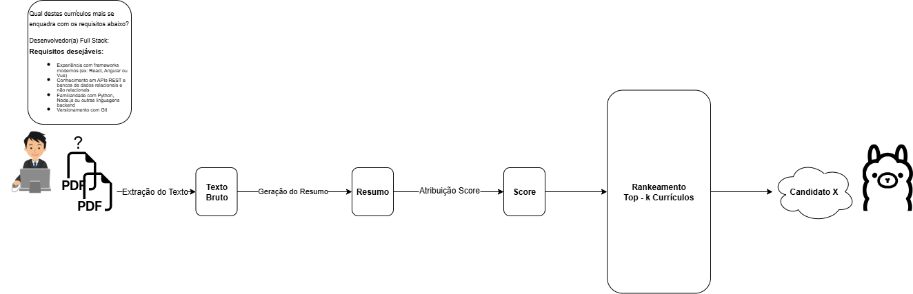
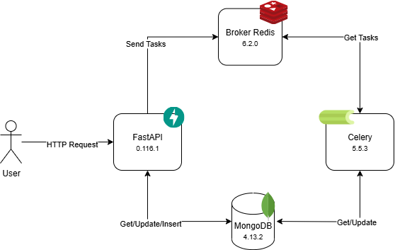

# ResumeRanker — Análise Inteligente de Currículos com OCR + LLM

Fabio, gerente de Talent Acquisition da startup TechMatch, enfrentava um grande desafio: analisar manualmente dezenas de currículos em PDF ou imagem todos os dias. O processo era repetitivo, demorado e o impedia de focar em decisões estratégicas de contratação.

Pensando nisso, esta aplicação foi desenvolvida para automatizar a leitura, sumarização e ranqueamento de currículos usando técnicas de OCR e modelos de linguagem (LLMs). Fabio agora pode simplesmente enviar os arquivos, fazer perguntas do tipo _"Qual currículo melhor se encaixa nessa vaga?"_ e receber respostas precisas com justificativas — economizando horas de trabalho.

---

## Funcionalidades

- Upload de múltiplos documentos (PDF, JPG/PNG)
- Extração de texto via OCR (EasyOCR)
- Geração de sumários individuais por currículo
-  Resposta a queries com justificativas baseadas nos currículos
- Registro de logs de uso com:
  - `request_id`
  - `user_id`
  - `timestamp`
  - `query`
  - `result`
- Sem armazenamento completo dos arquivos (apenas metadados)
- Empacotado com Docker
- Swagger interativo com exemplos de uso

---

## Tecnologias Utilizadas

- **FastAPI** — API RESTful com documentação automática (Swagger/OpenAPI)  
- **EasyOCR** — Extração de texto de imagens e PDFs  
- **MongoDB** — Banco de dados não relacional para armazenamento de logs  
- **Celery + Redis** — Processamento assíncrono e fila de tarefas  
- **Ollama ou Gemini** — Serviço de IA para geração de respostas e sumários  
- **Docker** — Empacotamento e execução da aplicação  

---

## Fluxo da Aplicação

1. Usuário envia documentos (PDFs ou imagens) via API.
2. Os arquivos são salvos no storage e os nomes são enviados para um **worker Celery**.
3. O worker:
   - Extrai texto com OCR
   - Resume o conteúdo
   - Gera embeddings
   - Calcula a similaridade com a vaga usando **distância do cosseno**
4. Apenas documentos com **score > 50%** são enviados para avaliação do modelo LLM.
5. O modelo retorna os currículos que mais combinam com a vaga, com **justificativas claras**.
6. A execução é registrada no MongoDB para fins de auditoria e rastreabilidade.

As imagens abaixo ilustram o pipeline de execução da aplicação e a arquitetura geral do sistema:
## Pipeline da Aplicação

## Diagrama da Arquitetura


---

## Instalação

### 1. Clone o repositório

```bash
git clone https://github.com/Elygledson/resume-ranker
cd resume-ranker
```

---

## Configure o .env

### 2. Crie um arquivo .env com o seguinte conteúdo:

> Você pode **alternar o serviço de IA** (entre `ollama` e `gemini`) apenas alterando a variável `AI_SERVICE_NAME` — graças à implementação dos padrões **Factory** e **Strategy**, não é necessário modificar o código para essa troca.


```bash
# REDIS
REDIS_HOST=localhost
REDIS_PORT=6379
REDIS_DB=0

# AI SERVICE
AI_SERVICE_NAME=ollama  # ou gemini
AI_SERVICE_KEY=http://localhost:11434/api  # ou sua chave da Gemini

# MONGODB
MONGO_INITDB_ROOT_PORT=27017
MONGO_INITDB_ROOT_DBNAME=teste
MONGO_INITDB_ROOT_HOST=localhost
MONGO_INITDB_ROOT_USERNAME=admin
MONGO_INITDB_ROOT_PASSWORD=admin123
```

---

## Execute com Docker Compose

```bash
docker compose up -d --build
```

## Como usar a aplicação?

Para utilizar a aplicação, é necessário fazer requisições HTTP utilizando ferramentas como **Postman**, **Swagger UI** ou qualquer cliente de API de sua preferência.

A documentação interativa da API está disponível em:

🔗 **http://localhost:8000/doc**

Nela, você encontrará todos os endpoints organizados por módulos:

---

### 🔹 Módulos disponíveis

- **Analyzer**
- **Logs**

---

### 🔍 1. Analyzer

Este módulo é responsável por iniciar a análise dos currículos.

Você deve fazer uma requisição `POST` para o endpoint `/analyze-resume`, enviando os seguintes campos via **form-data**:

- `files`: Um ou mais arquivos (PDF, JPEG, PNG)
- `request_id`: Identificador único da requisição (UUID)
- `user_id`: Identificador do usuário solicitante (UUID)
- `query`: *(opcional)* Texto da vaga ou pergunta a ser usada na análise

#### Resposta esperada:
A API irá retornar um `log_id`.  
Esse ID identifica a requisição de análise e pode ser usado para consultar o resultado posteriormente.

O log inicialmente terá o status `PROCESSING`, pois os arquivos estão sendo analisados de forma assíncrona por um worker.

**Destaque Importante:**  
Graças à implementação de padrões de projeto como **Factory** e **Strategy**, é possível **adicionar ou trocar serviços de análise, OCR ou LLM de forma rápida e modular**, sem alterar o núcleo da aplicação. Isso garante escalabilidade e facilidade de manutenção.

---

### 2. Verificar status da análise

Com o `log_id` em mãos, você pode consultar o resultado da análise utilizando o endpoint:

GET /logs/{log_id}

#### Possíveis status:
- `PROCESSING`: A análise ainda está em andamento.
- `PROCESSED`: A análise foi concluída com sucesso.
- `FAILED`: Ocorreu uma falha no processamento.

Se o status for `PROCESSED`, o log conterá também o resultado da análise — incluindo os currículos mais compatíveis com a vaga, acompanhados de justificativas claras.

### 3. Oportunidades de melhoria:
- Realizar testes mais abrangentes para garantir robustez e confiabilidade.

- Adicionar um serviço de armazenamento (por exemplo, MinIO) para gerenciar arquivos de forma mais eficiente.

- Criar uma validação pré-processamento que verifique se o arquivo enviado é realmente um currículo antes de prosseguir com o processamento.

### 4. Observações:

Se você não pretende utilizar o Ollama, remova previamente o container relacionado antes de construir os demais, evitando recursos desnecessários do docker-compose.yml antes de executar o docker compose up -d --build.

Caso seu ambiente possua suporte a CUDA, é possível executar o Ollama com aceleração por GPU. Para isso, adicione o seguinte serviço ao seu docker-compose.yml:

```bash
  ollama:
    build:
      context: ./ollama
      dockerfile: Dockerfile
    container_name: resume_analyzer_ollama
    ports:
      - "11434:11434"
    volumes:
      - ollama_vol:/ollama
    networks:
      - resume_analyzer_network
    entrypoint: [ "/usr/bin/bash", "pull-llama3.sh" ]
    restart: unless-stopped
    deploy:
      resources:
        reservations:
          devices:
            - capabilities: [gpu]
```
Certifique-se de que o driver NVIDIA e o NVIDIA Container Toolkit estejam instalados no host para que a GPU seja reconhecida no container.

---
